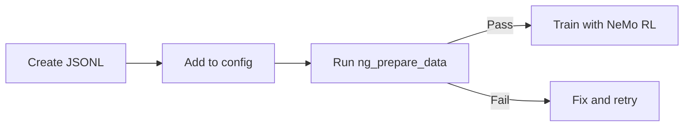

NeMo Gym datasets use JSONL format for reinforcement learning (RL) training. Each dataset connects to an **agent server** (orchestrates agent-environment interactions) which routes requests to a **resources server** (provides tools and computes rewards).

## Prerequisites

- **NeMo Gym installed**: See [Installation](/get-started/installation)
- **Repository cloned** (for built-in datasets):
  ```bash
  git clone https://github.com/NVIDIA-NeMo/Gym.git
  cd Gym
  ```

<Note>
NeMo Gym uses OpenAI-compatible schemas for model server compatibility. **No OpenAI account required**—local servers like vLLM use the same format.

</Note>

## Data Format

Each JSONL line requires a `responses_create_params` field following the [OpenAI Responses API schema](https://platform.openai.com/docs/api-reference/responses/create):

```json
{"responses_create_params": {"input": [{"role": "user", "content": "What is 2+2?"}]}}
```

Additional fields like `expected_answer` vary by resources server—the component that provides tools and reward signals.

### Required Fields

| Field | Added By | Description |
|-------|----------|-------------|
| `responses_create_params` | User | Input to the model during training. Contains `input` (messages) and optional `tools`, `temperature`, etc. |
| `agent_ref` | `ng_prepare_data` | Routes each row to its agent server. Auto-generated during data preparation. |

### Optional Fields

| Field | Description |
|-------|-------------|
| `expected_answer` | Ground truth for verification (task-specific). |
| `question` | Original question text (for reference). |
| `id` | Tracking identifier. |

<Tip>
Check `resources_servers/<name>/README.md` for fields required by each resources server's `verify()` method.

</Tip>

### The `agent_ref` Field

The `agent_ref` field maps each row to a specific agent server, which in turn knows its resources server from the YAML config. A training dataset can blend multiple agent servers in a single file—`agent_ref` tells NeMo Gym which server handles each row.

```json
{
  "responses_create_params": {"input": [{"role": "user", "content": "..."}]},
  "agent_ref": {"type": "responses_api_agents", "name": "math_with_judge_simple_agent"}
}
```

**You don't create `agent_ref` manually.** The `ng_prepare_data` tool adds it automatically based on your config file. The tool matches the agent type (`responses_api_agents`) with the agent name from the config.

### Example Data

```json
{"responses_create_params": {"input": [{"role": "user", "content": "What is 2+2?"}]}, "expected_answer": "4"}
{"responses_create_params": {"input": [{"role": "user", "content": "What is 3*5?"}]}, "expected_answer": "15"}
{"responses_create_params": {"input": [{"role": "user", "content": "What is 10/2?"}]}, "expected_answer": "5"}
```

## Quick Start

Run this command from the repository root:

```bash
config_paths="responses_api_models/vllm_model/configs/vllm_model_for_training.yaml,\
resources_servers/example_multi_step/configs/example_multi_step.yaml"

ng_prepare_data "+config_paths=[${config_paths}]" \
    +output_dirpath=data/test \
    +mode=example_validation
```

**Success**: `Finished!` message and `data/test/example_metrics.json` created.

## Dataset Types

| Type | Purpose | License |
|------|---------|---------|
| `example` | Testing and development | Not required |
| `train` | RL training data | Required |
| `validation` | Evaluation during training | Required |

## Configuration

Define datasets in your agent server's YAML config:

```yaml
datasets:
  - name: train
    type: train
    jsonl_fpath: resources_servers/workplace_assistant/data/train.jsonl
    huggingface_identifier:
      repo_id: nvidia/Nemotron-RL-agent-workplace_assistant
      artifact_fpath: train.jsonl
    license: Apache 2.0
```

| Field | Required | Description |
|-------|----------|-------------|
| `name` | Yes | Dataset identifier |
| `type` | Yes | `example`, `train`, or `validation` |
| `jsonl_fpath` | Yes | Path to data file |
| `license` | Train/validation | See valid values below |
| `huggingface_identifier` | No | Remote download location |
| `num_repeats` | No | Repeat count (default: `1`) |

### Valid Licenses

`Apache 2.0` · `MIT` · `GNU General Public License v3.0` · `Creative Commons Attribution 4.0 International` · `Creative Commons Attribution-ShareAlike 4.0 International` · `TBD` · `NVIDIA Internal Use Only, Do Not Distribute`

## Workflow



## Validation Modes

| Mode | Scope | Use Case |
|------|-------|----------|
| `example_validation` | `example` datasets | Format check before contributing |
| `train_preparation` | `train` + `validation` | Full prep for RL training |

To prepare training data with auto-download:

```bash
config_paths="responses_api_models/vllm_model/configs/vllm_model_for_training.yaml,\
resources_servers/workplace_assistant/configs/workplace_assistant.yaml"

ng_prepare_data "+config_paths=[${config_paths}]" \
    +output_dirpath=data/workplace_assistant \
    +mode=train_preparation \
    +should_download=true
```

<Tip>
HuggingFace downloads require authentication. Set `hf_token` in `env.yaml` or export `HF_TOKEN`.

</Tip>

## Common Errors

| Error | Cause | Fix |
|-------|-------|-----|
| `JSON parse error at line N` | Invalid JSON | Check quotes, commas, brackets at line N |
| `ValidationError: responses_create_params` | Missing field | Add `responses_create_params.input` |
| `A license is required` | Missing license | Add `license` to dataset config |
| `Missing local datasets` | File not found | Check path or add `+should_download=true` |

## Guides

<Cards>

<Card title="Prepare and Validate" href="/data/prepare-validate">
Full data preparation workflow.

<Badge minimal outlined>data-prep</Badge>
</Card>

<Card title="Download from Hugging Face" href="/data/download-huggingface">
Fetch datasets from HuggingFace Hub.

<Badge minimal outlined>huggingface</Badge>
</Card>

<Card title="Prompt Config" href="/data/prompt-config">
YAML-based prompt templates applied at rollout time.

<Badge minimal outlined>prompts</Badge>
</Card>

</Cards>

## CLI Commands

| Command | Description |
|---------|-------------|
| `ng_prepare_data` | Validate and generate metrics |
| `ng_download_dataset_from_hf` | Download from HuggingFace |

See [CLI Commands](/reference/cli-commands) for details.

## Large Datasets

- Validation streams line-by-line (memory-efficient)
- Single-threaded; &gt;100K samples may take minutes
- Use `num_repeats` instead of duplicating JSONL lines
